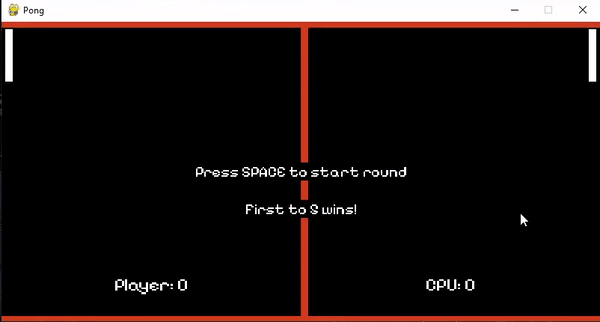

# PyGame Pong

A simple Pong game made using the PyGame framework.

## How It's Made:

**Tech used:** Python, PyGame

## Optimizations

One key optimization that I did was refactoring some of my functional logic into an object-oriented approach. Rather than using functions to generate all of the objects in the game, I created a class for the paddles and the ball to encapsulate the methods and attributes each object needed.

Other small adjustments include optimizations of sprite movement, collisions, and edge cases.

## Lessons Learned:

I gained familiarity with a new framework in Python, as well as some experience in game development using Python.

